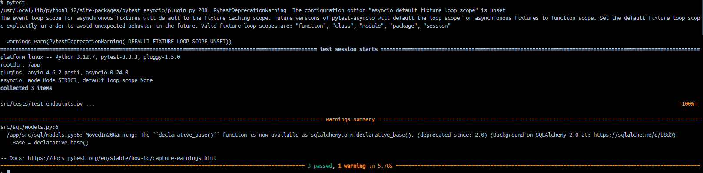

# Desafio Itaú

Este é um guia espeficífico para realização dos testes e execução do docker compose.
A documentação especifica sobre as rotas se encontram na rota ***/docs***.

## Execução do docker compose

### Configuração inicial
---
Para a execução exitosa da aplicação é necessário a inicialização do docker compose, que é responsavel por criar e configurar todos os serviços necessários para rodar a aplicação em questão. Assim sendo, os próximos passos serão fundamentais para que esse passo primordial seja feito de maneira correta.


O primeiro passo para configurar este arquivo é inserir sua **api-key** da Open AI, no app, para que seja possivel a criação dos resumos. Essa chave pode ser obitida no portal de desenvolvimento da Open AI


Vá para as configuração clicando no simbolo de engrenagem ao lado da sua foto de perfil e acesse ao menu do lado esquerdo **PROJECT>APIKeys**


Clique em **Create new secrect key** e copie o valor dentro do arquivo do docker-compose.yml no campo ***OPENAI_API_KEY***

Feito isso podemos inicializar os comandos para subir os containers da aplicação.

### Inicializando o docker-compose

Feito o passo de configurar o docker-compose, é necessário utilizar os comandos para subir nossa aplicação.

Dentro da pasta onde está o arquivo do docker-compose, abra um terminal e execute o seguinte comando:

```
docker-compose build
```
Este comando irá montar a imagem docker.


Para inicializar o docker-compose execute:

```
docker-compose up -d
```


Feito isso já é possivel observar que os containers foram criados, o que finaliza esta seção.


## Realização dos testes.

### Utilização do pytest
---
Este projeto se utilza do pacote de testes chamado pytest.

Para executá-lo é necessário acessar o docker da aplicação, que possui o nome: api


Uma vez dentro do terminal do docker desta aplicação (**api**) execute o seguinte comando: 

```
pytest
```



### Via Swagger
---
Outra maneira de testar a API é por meio da rota de documentação ***/docs***, que oferece uma visão detalhada das rotas disponiveis nesta api.


É possivel testar as rota desejada apenas clicando na mesma


A partir disso, clique em **Try it out** preencher os dados de **url** e **char_amount** e por fim clicar em execute.


E após isso será retornado o resultado, no caso um resumo deste artigo da wikipedia


